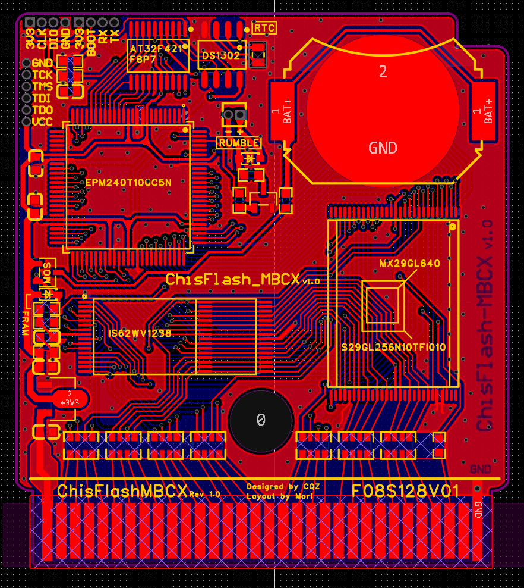

# ChisFlash-MBCX

> A single-cartridge solution for Game Boy / Game Boy Color. By programming different CPLD firmware files, the board can be configured as either an `MBC3 RTC` cartridge or an `MBC5 rumble` cartridge.

[简体中文](README.md) | English

[](LICENSE)

[](https://oshwhub.com/morinaka/chisflash-cqz)



## Overview

`ChisFlash-MBCX` is a single-cartridge project in the ChisFlash ecosystem. It is intended for two hardware configurations:

- `MBC3 RTC` cartridge
- `MBC5 rumble` cartridge

According to the original project notes, the board can switch between these two modes by flashing different firmware. The project was developed by `兜鬼巨神兵 (CQZ)` and published by `mori`.

## Highlights

- One PCB design with two practical cartridge modes
- Includes `Gerber`, `PCB project`, `CPLD firmware`, and `MCU firmware`
- Useful for retro cartridge building, study, and community-driven hardware reproduction
- OSHWHub project page is available for BOM and assembly reference

## Quick Links

- OSHWHub page: [oshwhub.com/morinaka/chisflash-cqz](https://oshwhub.com/morinaka/chisflash-cqz)
- Board image: [picture/ChisFlash_MBCX.png](picture/ChisFlash_MBCX.png)
- Gerber package: [gerber/Gerber_ChisFlash-MBCX-CQZ_2025-11-29.zip](gerber/Gerber_ChisFlash-MBCX-CQZ_2025-11-29.zip)
- PCB project: [pcb/ProDoc_ChisFlash-MBCX-CQZ_2025-11-29.epro](pcb/ProDoc_ChisFlash-MBCX-CQZ_2025-11-29.epro)
- RTC CPLD firmware: [pof/CPLD_ChisFlash_MBCX_RTC.pof](pof/CPLD_ChisFlash_MBCX_RTC.pof)
- Rumble CPLD firmware: [pof/CPLD_ChisFlash_MBCX_Motor.pof](pof/CPLD_ChisFlash_MBCX_Motor.pof)
- RTC MCU firmware: [mcu/MCU_ChisFlashRTC.hex](mcu/MCU_ChisFlashRTC.hex)

## Repository Layout

| Path | Description |
| --- | --- |
| `gerber/` | Manufacturing Gerber archive |
| `pcb/` | Source PCB project file |
| `pof/` | CPLD firmware for RTC / rumble modes |
| `mcu/` | MCU firmware for the RTC version |
| `picture/` | Images and project assets |

## Modes

| Mode | Files | MCU / RTC chip required | Notes |
| --- | --- | --- | --- |
| `MBC3 RTC` | `pof/CPLD_ChisFlash_MBCX_RTC.pof` + `mcu/MCU_ChisFlashRTC.hex` | Yes | For RTC-enabled cartridges |
| `MBC5 rumble` | `pof/CPLD_ChisFlash_MBCX_Motor.pof` | No | MCU and RTC chip can be omitted to reduce power usage |

## Build Notes

1. Use the BOM / assembly reference from the OSHWHub page to prepare parts and solder the board.
2. Flash the CPLD firmware for either the `RTC` or `rumble` configuration.
3. For the RTC version, also solder the MCU and RTC chip, then flash the MCU firmware through `SWD` or `TTL`.
4. For the rumble version, the MCU and RTC chip can be left unpopulated.
5. Do not forget the resistor near the lower-left side of the battery area, otherwise battery power will not be supplied correctly.

> A through-hole crystal is recommended for better stability and lower drift.

## 2025-11-18 Update

- Added one `0-ohm` resistor option for FRAM-related modification
- When using `SRAM`, install the `0-ohm` resistor
- When using FRAM, do not install the `0-ohm` resistor; instead short the diode and resistor pads

## Licensing and Attribution

- This repository currently includes a [GPL-3.0](LICENSE) license file.
- The original project notes also request the following attribution when the project is sold by individual makers:

```text
Thanks to 兜鬼巨神兵（CQZ） for development and open-sourcing, and thanks to the chis team for their contribution.
```

- If you plan commercial products based on this project, it is recommended to contact `兜鬼巨神兵 (CQZ)` first for coordination.

## Community Links

- QQ group: `771688226`
- CQZ Bilibili: [space.bilibili.com/371016269](https://space.bilibili.com/371016269)
- chisbread OSHWHub: [oshwhub.com/chisbread/works](https://oshwhub.com/chisbread/works)
- chisbread Bilibili: [space.bilibili.com/811896](https://space.bilibili.com/811896)
- mori OSHWHub: [oshwhub.com/morinaka/works](https://oshwhub.com/morinaka/works)
- mori Bilibili: [space.bilibili.com/1825944](https://space.bilibili.com/1825944)
